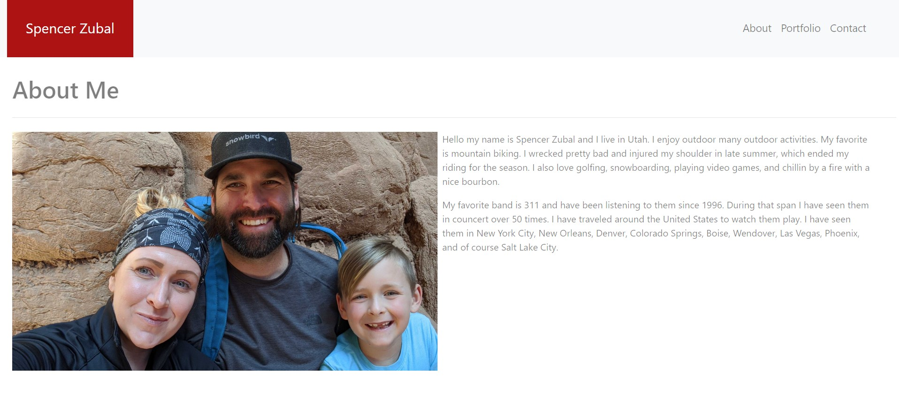
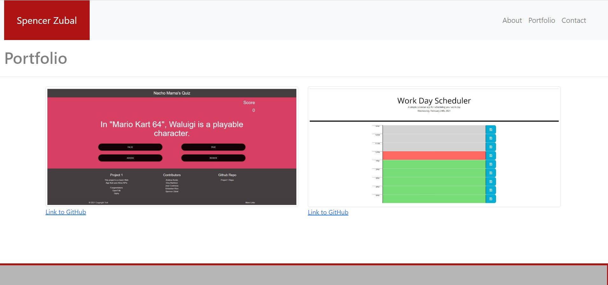

# Responsive-Portfolio

# Description
The task was to create a responsive portfolio utilizing Bootstrap framework. It included creating multipages that needed a navbar, responsive layout, and responsive images. The pages that were needed were And About Me page, a Portfolio, and a Contact page.

This task help create a template for a portfolio that can be updated as time goes on. Having the portfolio will allow it to be viewed on a desktop computer or mobile device.
<<<<<<< HEAD

We have a few new homework and projects completed so The protfolio has been updated with this new information. It also includes links to my LinkedIn and GitHub pages. You can access the the live Project 1 and Daily Planner pages by clicking the images. There is also a link to the GitHuib repository.
# About Me Screenshot

# Portfolio

 
# Contact

=======
# About Me
https://user-images.githubusercontent.com/73494903/102184798-4a124200-3e6d-11eb-9d00-9c7bcd4f2a9c.png

# Portfolio
https://user-images.githubusercontent.com/73494903/102184890-6d3cf180-3e6d-11eb-9752-a9ca3489ccd1.png
 
# Contact
https://user-images.githubusercontent.com/73494903/102184951-8645a280-3e6d-11eb-9c00-ffa7d0c99985.png
>>>>>>> ecfb384adbcc9e30fb54275d4089863aefd2054e
